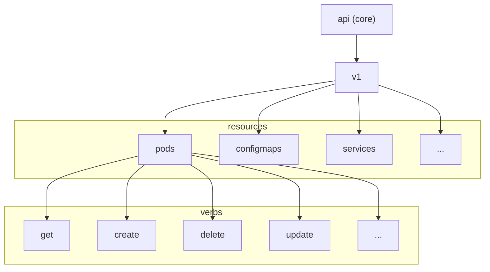
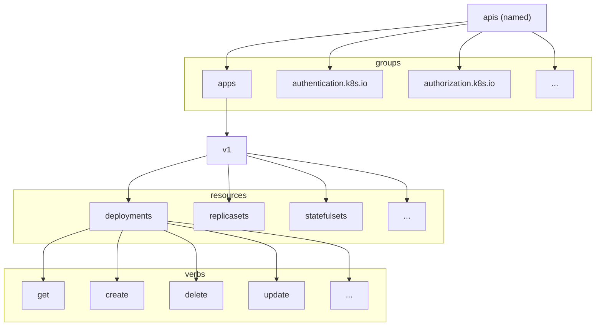

# API Groups

## Directly Call Kube API Server

```shell
curl https://kube-master-ip:6443 --key {{access key}} --cert {{certificate}} --cacert {{ca certificate}}
```

## Different API Groups

* `/metrics`
* `/healthz`
* `/version`
* `/api` -> Core group
* `/apis` -> Named group
* `/logs`





## Access Kube API Server Through Kubectl Proxy

```shell
# start kubectl proxy
kubectl proxy

# call kube api server using curl
curl http://127.0.0.1:8001
```

> Note:
> kube proxy != kubectl proxy