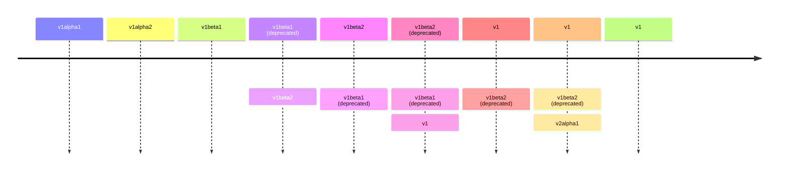

# API Versions

## Version Levels

* `Alpha`
* `Beta`
* `Stable` [GA - General Availability]


|                    | Alpha                          | Beta                                                                | Stable                                        |
|--------------------|--------------------------------|---------------------------------------------------------------------|-----------------------------------------------|
| Format             | vxalphay                       | vxbetay                                                             | vx                                            |
| e.g.               | v1alpha1                       | v1beta1                                                             | v1                                            |
| Enabled by default | No                             | Yes                                                                 | Yes                                           |
| Testing            | Not well tested                | Have e2e tested                                                     | Well tested                                   |
| Reliability        | May have bugs                  | May have minor bugs                                                 | Highly reliable                               |
| Support            | May be dropped in future       | Will complete the feature and will be available as a stable release | Will available in current and future versions |
| Audience           | Expert users for early testing | Beta testers                                                        | All users                                     |

## Disabling API Groups

```shell
kube-apiserver --runtime-config=batch/v1=false
```

* Here `kube-apiserver` is the kube api server binary
* `--runtime-config` flag accept a comma separated {{key}}[={{value}}] pairs string

## Enabling API Groups

```shell
kube-apiserver --runtime-config=batch/v2alpha1
```

## Preferred Version and Storage Version

* Preferred version
  * Default version
  * Version used in kube api server
* Storage Version
  * Version stored in etcd
* (Preferred version) != (Storage version)
* But most of the time the preferred version and storage version are the same

## View Preferred Version From Kubectl

```shell
kubectl explain {{resource name}}
```

e.g.,
* Command:
```shell
kubectl explain pods
```

* Output:

```shell
KIND:       Pod
VERSION:    v1
```

## View Preferred Version From Kube API Server

* API request:
```shell
curl "127.0.0.1:8001/apis/batch"
```

* Output:
```json
{
  "kind": "APIGroup",
  "apiVersion": "v1",
  "name": "batch",
  "versions": [
    {
      "groupVersion": "batch/v1",
      "version": "v1"
    }
  ],
  "preferredVersion": {
    "groupVersion": "batch/v1",
    "version": "v1"
  }
}
```

## API deprecation rules

* API elements may only be removed by increasing the version number of the API group
* When changing the version of an API object, there should not be any information loss
  * Some versions mayn't have some fields in the object
* A version can't be deprecated with a less stable version
  * A GA version only can be deprecated with another GA version
  * A beta version only can be deprecated with another GA or beta version
  * An alpha version can be deprecated with any version
* Versions' supporting periods
  * Stable: 12 months or 3 releases
  * Beta: 9 months or 3 releases
  * Alpha: 0 releases (no need of supporting older versions)
* A preferred or storage version only can be changed after making a release with both new and previous versions



## Convert Versions Of API Objects With Kubectl Convert

* Kubectl convert plugin doesn't come by default
  * Need to install kubectl convert plugin separately

```shell
kubectl convert -f {{manifest file of one version}} --output-version {{required version}}
```
