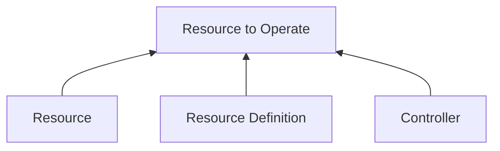

# Custom Resources

## 3 Main Components Required For A Resource To Operate



## Custom Resource Definitions Manifest File

```yaml
apiVersion: apiextensions.k8s.io/v1
kind: CustomResourceDefinition
metadata:
  name: cars.pagani.com
spec:
  scope: Namespaced # Namespaced | Cluster
  group: pagani.com # api group name in resource manifest file
  names:
    kind: Car # Kind in the resource manifest file; Usually the camel case of singular name
    plural: cars # used for referring the resource; used on kubectl commands
    singular: car # used as an alias on kubectl commands
    shortNames: # short name to use in kubectl commands
      - c
      - cr
  versions: # list of resource versions
    - name: v1
      served: true # enable or disable the version; multiple versions can be enabled at once
      storage: true # storage version of the resource; only one version can be the storage version
      schema:
        openAPIV3Schema:
          type: object
          properties:
            spec:
              type: object
              properties:
                model:
                  type: string
                engine:
                  type: string
                max-speed:
                  type: integer
```

## Custom Controllers

* We can create custom controllers in any language
    * But Go lang is preferred
    * Because there are libraries for Go lang
    * Sample Go lang custom controller: https://github.com/kubernetes/sample-controller
* We can deploy the custom controller as a pod inside the same cluster

## Operator Framework

* An operator is a package bundled with custom controllers, custom resource definitions, and extra utils
* Operators extend Kubernetes with custom resources
* Operators provide more advanced configurations than helm
* But Helm is easier than Operators