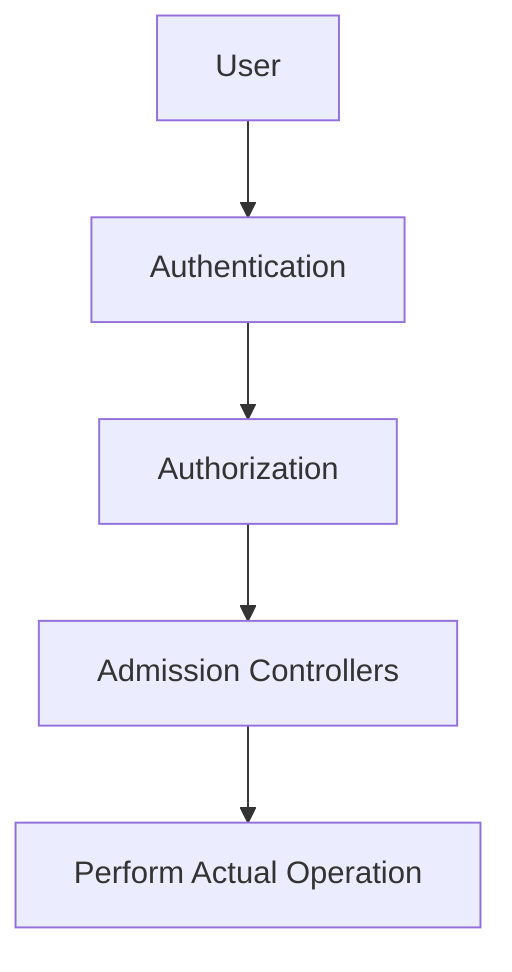

# Admission Controllers

## What Are Admission Controllers



* Admission Controllers are code pieces with in the Kubernetes API server to check data and perform operations on modifying requests
* Admission controllers are only applicable to modifying resources request
* Admission controllers aren't affected to read resource requests
  * Read resource requests bypass admission controller layer
  * e.g., get, watch, and list

## Enable Admission Controllers

* `--enable-admission-plugins` flag is used for enabling admission controllers

```shell
kube-apiserver --enable-admission-plugins=NamespaceLifecycle,LimitRanger 
```

* Here `kube-apiserver` is the kube api server binary
* For modify `kube-apiserver` configs:
  * Just edit `/etc/kubernetes/manifests/kube-apiserver.yaml`
  * Wait for a few minutes

## Disable Admission Controllers

* `--disable-admission-plugins` flag is used for disabling admission controllers

```shell
kube-apiserver --disable-admission-plugins=PodNodeSelector,AlwaysDeny
```

## View Enabled Admission Controllers

```shell
kube-apiserver -h | grep enable-admission-plugins
```