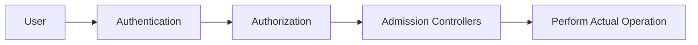
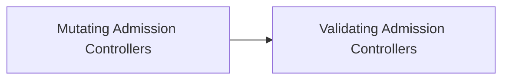
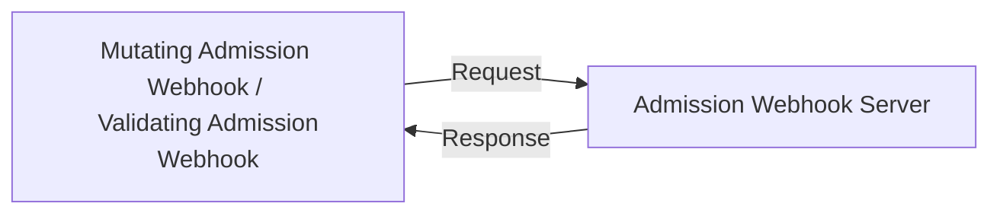

# Admission Controllers

## What Are Admission Controllers



* Admission Controllers are code pieces with in the Kubernetes API server to check data and perform operations on modifying requests
* Admission controllers are only applicable to modifying resources request
* Admission controllers aren't affected to read resource requests
  * Read resource requests bypass admission controller layer
  * e.g., get, watch, and list

## Enable Admission Controllers

* `--enable-admission-plugins` flag is used for enabling admission controllers

```shell
kube-apiserver --enable-admission-plugins=NamespaceLifecycle,LimitRanger 
```

* Here `kube-apiserver` is the kube api server binary
* For modify `kube-apiserver` configs:
  * Just edit `/etc/kubernetes/manifests/kube-apiserver.yaml`
  * Wait for a few minutes

## Disable Admission Controllers

* `--disable-admission-plugins` flag is used for disabling admission controllers

```shell
kube-apiserver --disable-admission-plugins=PodNodeSelector,AlwaysDeny
```

## View Enabled Admission Controllers

```shell
kube-apiserver -h | grep enable-admission-plugins
```

or

```shell
ps -ef | grep kube-apiserver | grep admission-plugins
```

## Types Of Admission Controllers

* 2 types of Admission Controllers:
  * `Validating Admission Controllers`
  * `Mutating Admission Controllers`
* Mutating admission controllers are executed first, then validating admission controllers are executed
* Some admission controllers can do both mutating and validating



## Custom Admission Controllers

* 2 webhooks that can be used for creating custom admission controllers:
  * `Mutating Admission Webhook`
  * `Validating Admission Webhook`
* Custom admission controllers are executed after the builtin admission controllers

## Creating a custom admission controller:

1. Create webhook server
2. Deploy webhook server
3. If the webhook server is deployed as a Kubernetes deployment => Create a service for the webhook server
4. Create a webhook configuration object

## How webhook server works



Minimal Response:
```json lines
{
  "apiVersion": "admission.k8s.io/v1",
  "kind": "AdmissionReview",
  "response": {
    "uid": "<value from request.uid>",
    "allowed": true // true: allow, false: deny
  }
}
```

Full Response Format:
```json lines
{
  "apiVersion": "admission.k8s.io/v1",
  "kind": "AdmissionReview",
  "response": {
    "uid": "<value from request.uid>",
    "allowed": true, // true: allow, false: deny
    "patchType": "JSONPatch", // only supported type is JSONPatch
    "patch": "AAAA", // base64 encoded json patch object
    "status": {
      "code": 200, // HTTP status code
      "message": "message" // Message
    }
  }
}
```

Json Patch Object Format:
```json lines
[
  {
    "op": "add",
    "path": "/spec/replicas",
    "value": 3
  },
  {
    "op": "replace",
    "path": "/metadata/labels/app",
    "value": "utopia"
  }
]
```

## Code Sample for Admission Webhook Server

```python
@app.route("/validate", methods=["POST"])
def validate():
  ...

@app.route("/mutate", methods=["POST"])
def mutate():
  ...
```

## Webhook Configuration Manifest File

```yaml
apiVersion: admissionregistration.k8s.io/v1
kind: ValidatingWebhookConfiguration
metadata:
  name: "pod-policy"
webhooks:
- name: "pod-policy"
  clientConfig: # webhook server connection configs
    service:
      namespace: "webhook-server-namespace"
      name: "webhook-server-service"
    caBundle: <CA_BUNDLE>
  rules: # when the admission controller should be applied
    - apiGroups:   [""]
      apiVersions: ["v1"]
      operations:  ["CREATE"]
      resources:   ["pods"]
      scope:       "Namespaced"
  admissionReviewVersions: ["v1"]
  sideEffects: None
  timeoutSeconds: 5
```

* `kind`:
  * For validating admission controllers => `ValidatingWebhookConfiguration`
  * For mutating admission controllers => `MutatingWebhookConfiguration`
