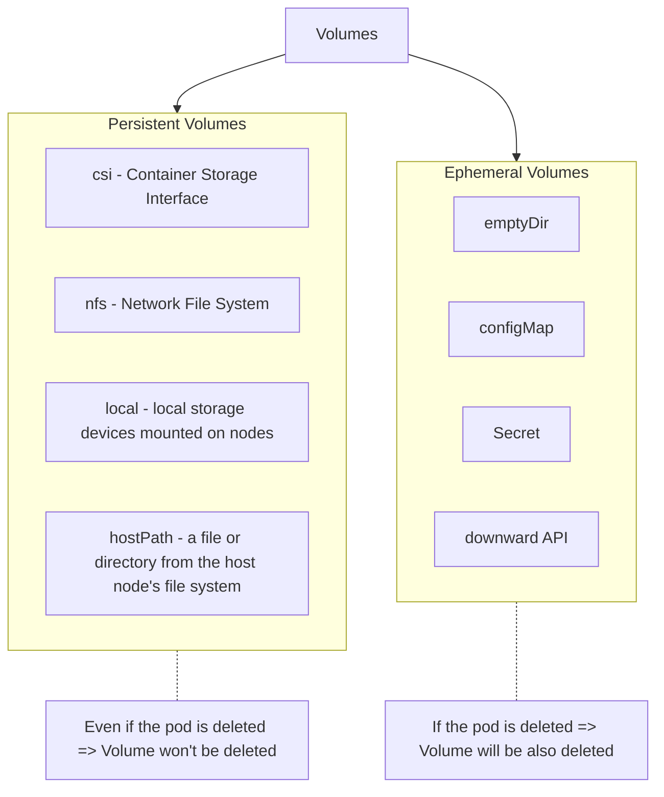

# Persistent Volume Claims



## Mount A Volume To A Pod

```yaml
apiVersion: v1
kind: Pod
metadata:
  name: car-pod
spec:
  containers:
    - name: app
      image: nginx:latest
      volumeMounts:
        - name: vol
          mountPath: /log
  volumes:
    - name: vol
      hostPath:
        path: /var/log
```
## Persistent Volume Manifest File

```yaml
apiVersion: v1
kind: PersistentVolume
metadata:
    name: pv-vol
spec:
    accessModes:
      - ReadWriteOnce
    persistentVolumeReclaimPolicy: Retain
    capacity:
        storage: 1Gi
    awsElasticBlockStore:
        volumeID: {{volume-id}}
        fsType: ext4
```

## Key Fields In Persistent Volume Manifest File

* `spec.accessModes`
  * The access mode capabilities are different from one storage type to another
  * Valid values:
    * `ReadWriteOncePod` (**Most Commonly used**)
      * Volume can be mounted only to one pod as read and write
      * Volume can't be mounted even for the pods in the same node
    * `ReadWriteOnce`
      * Volume can be mounted only to one node as read and write
      * Volume can be mounted to multiple Pods in the same node
    * `ReadOnlyMany`
      * Many nodes can mount the volumes as read-only
    * `ReadWriteMany`
      * Many nodes can mount the volume as read and write
* `spec.persistentVolumeReclaimPolicy`
  * What happens to the Persistent Volume after deleting the PVC (Persistent Volume Claim)
  * Values:
    * `Retain`:
      * Keep the PV
      * Keep the data
      * After deleting PVC, PV won't be available
        * PV's status will be `Released`
        * Has to manually reclaim the volume
    * `Delete`:
      * Delete the Persistent Volume
      * Also, delete the data
    * `Recycle`:
      * Keep the Persistent Volume
      * But delete the data
      * After deleting PVC, PV will be available
  * Default value: `Retain`

## Persistent Volume Claims

* PVC (Persistent Volume Claim) is used to mound a Persisted Volume to a Pod
* When PVCs look for a PV to bind:
  * (PVC storage size) <= (PV storage size)
  * A PVC finds the most suitable PV to bind
  * If no suitable PV => PVC's status will be `pending`
  * If we want a specific volume to bound => We can use `labels` and `selectors`
  * Both PV and PVC should have the same access modes
* After bounding PV to PVC, PVC's available capacity will be PV size
* When deleting PVC =>
  * If a Pod still uses PVC => PVC will be stuck in `terminating` state

## PVC Manifest File

```yaml
apiVersion: v1
kind: PersistentVolumeClaim
metadata:
    name: car-pvc
spec:
  accessModes:
    - ReadWriteOnce # refer Persistent Volume's spec.accessModes
  resources:
    requests:
      storage: 500Mi
  selector:
    matchLabels:
      release: "stable"
```
